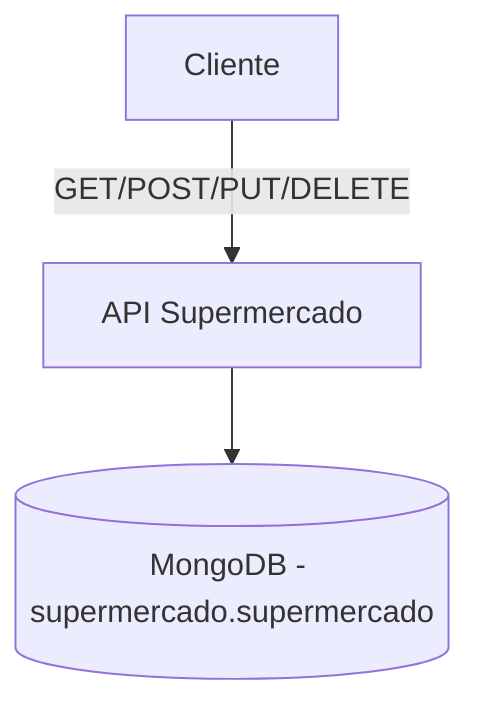

# 🛒 Supermercado API RESTful

API desarrollada con **Node.js**, **Express.js** y **MongoDB** para gestionar el inventario de productos de un supermercado. Permite realizar operaciones CRUD (Crear, Leer, Actualizar y Eliminar).

---

## 📋 Resumen de la documentación

| Método | Ruta                           | Descripción                                |
|--------|--------------------------------|--------------------------------------------|
| GET    | `/`                            | Mensaje de bienvenida                      |
| GET    | `/acerca-de`                   | Información general de la API              |
| GET    | `/productos`                   | Lista todos los productos                  |
| GET    | `/productos/codigo/:codigo`    | Busca producto por código                  |
| GET    | `/productos/categoria/:categoria` | Filtra productos por categoría          |
| POST   | `/productos`                   | Agrega un nuevo producto                   |
| PUT    | `/productos/codigo/:codigo`    | Actualiza un producto por su código        |
| DELETE | `/productos/codigo/:codigo`    | Elimina un producto por su código          |

---

## ⚙️ Instalación

1. Clona el repositorio y entra en la carpeta del proyecto:

```bash
git clone https://github.com/MikaCG/supermercado_MongoDB.git
cd supermercado_MongoDB
```
2. Instala las dependencias:

```bash
npm install
```

3. Crea un archivo .env en la raíz del proyecto con la siguiente variable:
```ini
PORT=3008
MONGODB_URLSTRING=tu_uri_de_mongodb
```

4. Ejecuta el servidor:
```bash
node server.js
```

## 📁 Estructura del Proyecto
La estructura del proyecto es la siguiente:
```bash
supermercado_MongoDB/
│
├── node_modules/
├── src/
│   └── mongodb.js            # Lógica de conexión a MongoDB
│
├── .env                      # Variables de entorno (URI y puerto)
├── package.json
├── package-lock.json
└── server.js                 # Definición del servidor y rutas
```

## 🔍 Ejemplos de uso
🧾 Obtener todos los productos
```bash
GET http://localhost:3008/productos
```

🔍 Buscar producto por código
```bash
GET http://localhost:3008/productos/codigo/1234
```

🔍 Buscar por categoría (sin distinción de mayúsculas o acentos)
```bash
GET http://localhost:3008/productos/categoria/lacteos
```

## ➕ Crear un nuevo producto
Requiere:
* nombre: string
* precio: number
* categoria: string

Ejemplo con curl:
```bash
curl -X POST http://localhost:3008/productos \
  -H "Content-Type: application/json" \
  -d '{"nombre": "Galletitas", "precio": 2.99, "categoria": "Comestible"}'
```

Ejemplo en JavaScript (fetch):
```js
fetch("http://localhost:3008/productos", {
  method: "POST",
  headers: { "Content-Type": "application/json" },
  body: JSON.stringify({
    nombre: "Yerba Mate",
    precio: 4.5,
    categoria: "Infusiones"
  })
});
```

## ✏️ Actualizar un producto por código
```bash
PUT http://localhost:3008/productos/codigo/1234
```

Cuerpo JSON ejemplo:
```json
{
  "precio": 7.99,
  "categoria": "Almacén"
}
```

## 🗑️ Eliminar un producto por código
```bash
DELETE http://localhost:3008/productos/codigo/1234
```

## 📊 Diagrama de Flujo

```markdown
[Visitar mermaid.live](https://mermaid.live/edit#pako:eNpNj1FrgzAQx79KuKcNrE1qjJqHQasyBhsr1L1M-xCaTGU1kVRhm-13XyyM9eW4H3e_-3MTHIxUwKG2om9QkVUaoXWZHlulB7VHi8XD-TEvltvXnStvxTLLn_MiP6NNud4-od3YK9spexDS7Gd1MxsoLe9ejK5N5hCdbnb8W7h3xuyA59JbCXywo_LATTsxI0zztIKhUZ2qgLtWCvtZQaUvzumFfjem-9OsGesG-Ic4nhyNvRSDylrh_vpfUVoqm5pRD8ADcj0BfIKvmQIfM5bEUZKsCIuZB9_Aw9CPo4jGBDNCCKYJvXjwcw3FfhRiGq9CRgMcBjSILr8XL2Wu "Mermaid Live" target="_blank")
```

## 🧪 Recomendaciones para pruebas
* Usar Postman o Insomnia para probar fácilmente los endpoints.
* Probar búsquedas por categoría con variantes de mayúsculas y acentos (ej. "LÁCTEOS", "lacteos", "Lacteós").

## 📣 Crédito
📌 Micaela Cajal Gallardo.

🧠 Desarrollado de la pre-entrega 02 para practicar la API RESTful utilizando Node.js, Express y MongoDB.
